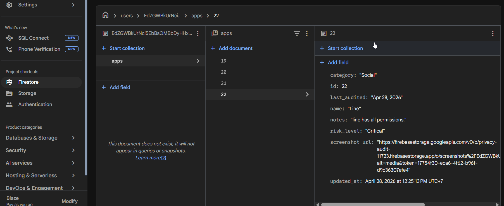
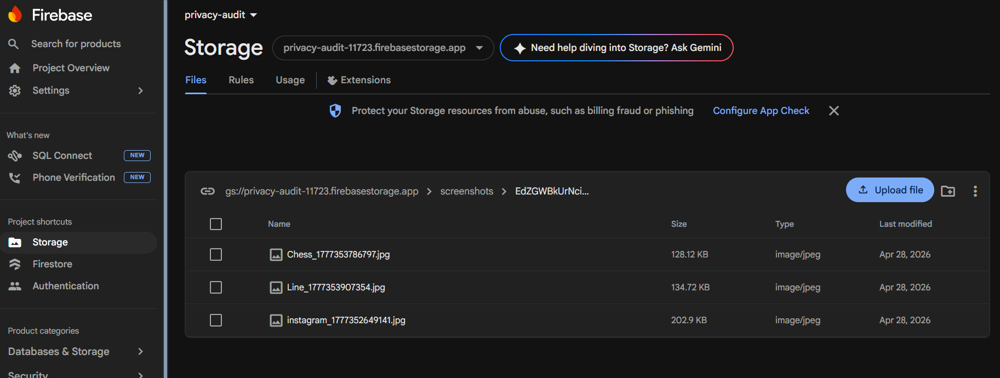
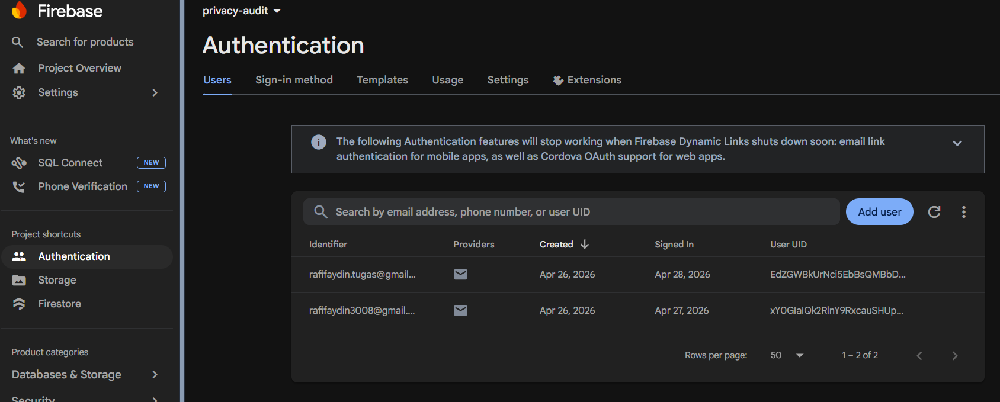

# Privacy Audit (App Permission Tracker)

A Flutter application that helps users audit and track the permissions granted to apps installed on their Android device. Users can log which apps have access to sensitive resources (camera, microphone, location, etc.), assign risk levels, attach screenshot evidence, and get notified to re-audit periodically.

---

## Application Features

| # | Features | 
|---|---|
| 1 | CRUD with a relational database | 
| 2 | Firebase Authentication | 
| 3 | Storing data in Firebase | 
| 4 | Notifications | 
| 5 | Smartphone resource (Camera and gallery/image picker) | 

---

## Screenshots

### Authentication
| Login | Register |
|---|---|
|  |  |

### Dashboard
| Home | Filter by Permission |
|---|---|
|  |  |

### CRUD Operations
| Add Entry | View Detail | Edit Entry | Delete Confirm |
|---|---|---|---|
|  |  |  |  |

### Camera, Image Picker, Screenshot Guide Feature
| Camera View | Image Picker | Screenshot Guide | Evidence Attached |
|---|---|---|---|
|  |  |  |  |

### Notifications
| Save Notification | Critical Risk Alert | Monthly Reminder |
|---|---|---|
|  |  | -|

### Firebase Console

- Firestore Data

    


- Firebase Storage



- Firebase Auth Users

    

---

## 1. CRUD with Relational Database (SQLite)

### Database Schema

```
┌────────────────────────────────────────┐
│                 apps                   │
├───────────────┬────────────────────────┤
│ id            │ INTEGER PRIMARY KEY    │
│ user_id       │ TEXT NOT NULL          │
│ name          │ TEXT NOT NULL          │
│ category      │ TEXT NOT NULL          │
│ risk_level    │ TEXT NOT NULL          │
│ notes         │ TEXT                   │
│ screenshot_url│ TEXT                   │
│ last_audited  │ TEXT NOT NULL          │
└───────────────┴────────────────────────┘
         │ 1 (one app)
         │
         │ many (many permissions)
┌────────▼───────────────────────────────┐
│              permissions               │
├───────────────┬────────────────────────┤
│ id            │ INTEGER PRIMARY KEY    │
│ app_id        │ INTEGER FK → apps.id   │
│ perm_type     │ TEXT NOT NULL          │
│ granted       │ INTEGER (0=No, 1=Yes)  │
│ reason        │ TEXT                   │
└───────────────┴────────────────────────┘
FOREIGN KEY (app_id) REFERENCES apps(id)
ON DELETE CASCADE
```

### CRUD Operations

| Operation | Method | Description |
|---|---|---|
| **Create** | `insertApp()` | Inserts a new app entry with user scoping |
| **Create** | `insertPermissions()` | Batch inserts all 9 permissions for an app |
| **Read** | `getAllApps()` | Fetches all app entries for the logged-in user |
| **Read** | `getPermissions()` | Fetches related permissions for a specific app |
| **Read** | `getRiskCounts()` | Aggregates app count grouped by risk level |
| **Update** | `updateApp()` | Updates app name, category, risk, notes |
| **Update** | `updatePermission()` | Updates granted status and reason per permission |
| **Delete** | `deleteApp()` | Deletes app row; CASCADE removes all its permissions |

---

## 2. Firebase Authentication

Full email/password authentication with automatic session persistence.

### Features
- **Register** — creates a new Firebase account
- **Login** — authenticates with email + password
- **Auto-login** — `authStateChanges()` stream; users stay logged in across app restarts
- **Logout** — signs out and returns to login screen
- **Email display** — current user's email is shown in the dashboard AppBar so users always know which account is active
- **Data isolation** — each user's SQLite and Firestore data is scoped to their UID

---

## 3. Storing Data in Firebase

Two Firebase services are used for cloud storage.

### 3a. Cloud Firestore

Every app entry (including its permissions list) is synced to Firestore after each create, update, or delete operation.

**Firestore collection structure:**
```
users/
  {uid}/
    apps/
      {appId}/
        name, category, risk_level, notes,
        screenshot_url, last_audited, updated_at,
        permissions: [
          { perm_type, granted, reason },
          ...
        ]
```


### 3b. Firebase Storage

Screenshot evidence photos are uploaded to Firebase Storage (not stored locally), so images are accessible from any device.

**Storage path structure:**
```
screenshots/
  {uid}/
    {AppName}_{timestamp}.jpg
```

When an entry is deleted, the photo is also deleted from Storage.

---

## 4. Notifications

The app triggers local notifications for the following events:

| Notification | When Triggered | Priority |
|---|---|---|
| **Entry Saved** | A new app entry is added | Normal |
| **Critical Risk Alert** | A new entry is saved with "Critical" risk | High |
| **Entry Updated** | An existing entry is edited and saved | Normal |
| **Entry Deleted** | An entry is removed | Normal |
| **Monthly Re-audit Reminder** | Scheduled 30 days after any save | Normal |

---

## 5. Smartphone Resource 

The device camera is used to capture screenshot evidence of an app's permission settings screen.

### Camera Features

| Feature | Description |
|---|---|
| **Live Preview** | Full-screen real-time camera viewfinder |
| **Take Photo** | Shutter button captures and saves to PrivacyAudit gallery album |
| **Front / Back Switch** | Toggle between cameras with one tap |
| **Preview & Confirm** | Review the photo before attaching it |
| **Pick from Gallery** | Select an existing photo from the device gallery |
| **Screenshot Guide** | Step-by-step bottom sheet: go to Settings → App → Permissions → take a system screenshot → pick from gallery |
| **Update Photo** | Existing evidence photo can be replaced from the detail/edit screen |


